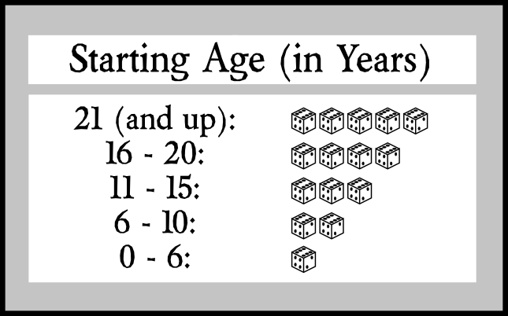
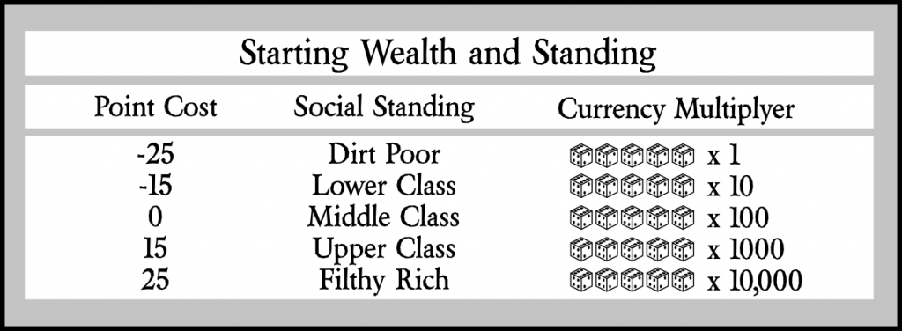
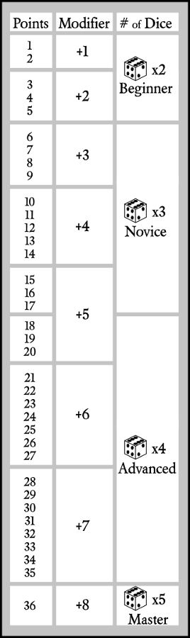

# Character Creation #
It is great to sit down to play a game with well-written characters. It is even better when the character's attributes and abilities are reflected in the story. Many players and game masters take pride in designing the characters and adventures they play, from the environment and backstory to appearance, to attitude and social disposition. They create interesting characters with compelling and intriguing lives. In these stories the characters are center stage and the Game Master is the guide.

## Starting Points ##
Every character, whether it is the Player or NPC, has starting points. These are the points that you will spend on Oddities and Skills. In order to be ready for the game, the sum of the points spent on Oddities and the character's Skills points must equal the sum of the Starting primary attribute Points for your character. The ability to sum and balance the character sheet is one feature that lends itself to translating the CCARPS system into other forms of media such as video games. A character's starting points are equal to the sum of the character's primary attributes.

### Starting Age ###
Starting Age is used to help add variety to the group's characters, where physical growth and past experience are taken into account. A character's starting age adds depth and a sense of connection between the character, their past, and their place in the game world. The first step in character creation is to choose the character's starting age. Second step is to find the character's starting age on the Starting Age Table to determine how many dice to roll for each attribute.

The third step is rolling your character's Primary Attributes. In general players roll five sets of dice according to the Starting Age Table and record each set in one of the primary attribute boxes. The primary attributes each have two boxes associated with them. The Accumulator box, and the Points box. The Accumulator box is used for storing adventure points during game play and is labeled Acc. *see Improving Your Character* for more information. The Points box, labeled Pts., is used to record the initial values for the character's primary attributes.

### Character Rank ###
Character rank is the sum of the character's Primary Attributes. After the player has rolled the character's primary attributes he or she willl sum all of the primary attributes together and use this table to determine the starting rank of their character. 

* Beginner: 75 points
* Novice: 90 points
* Advanced: 105 points
* Heroic: 120 points
* Epic: 135 points
* Legendary: 150 points

*Game Master Note:* If you want to boost characters rank, have the players roll extra dice sets to replace lower rolls, or have players re-roll all ones when rolling primary attributes to increase the total value for attribute points. Alternatively, the Game Master can assign a number of points that the player may distribute to boost their stats to more closely match the rank required by the adventure. *See Character Creation Conventions at the end of this section for alternate methods of rolling up characters.*

## Primary Attributes ##
*CCARPS* characters have five Primary Attributes:

* **Strength** (S): Capability of producing and/or withstanding great physical force.

* **Dexterity** (D): Skill in performing tasks, especially with the hands.

* **Constitution** (C): A person's physique or temperament; the general health of a person.

* **Intelligence** (I): The faculty of thinking, judging, abstract reasoning, and conceptual understanding.

* **Willpower** (W): The unwavering strength of will (intention, desire) to carry out one’s wishes.

## Secondary Attributes ##
The secondary attributes are average combinations of the primary attributesrounded to the nearest whole number. Once the secondary attribute base is calculated use the skill modifier table to determine the secondary attribute modifier. Skills are based on secondary attributes as are any action rolls where a character does not have a related skill. 

*Note:* Unskilled action rolls always use 2d, are limited to simple actions, are immune to critical success and failure, and are subject to a -6 situational modifier. Characters may not use the unskilled action rule to perform complex actions. A Complex Action is any action that is composed of two or more steps. *Complex Action example: knocking an arrow, drawing, aming, and firing a bow. This would require 4 separate dice rolls under the unskilled action rule. To successfully fire the arrow, the character would have to succeed on all of the rolls for the steps of the complex action. A failed roll would cause the character to start the whole process over from the beginning.*

* **Charisma** (CHA): Personal charm or magnetism, as determined by the health, intelligence, and will of the character.
Average of Constitution, Intelligence, and Willpower. (C + I + W) / 3 (rounded)

* **Speed** (SPD): The rate of motion or action.
Average of Strength and Dexterity. (S + D) / 2 (rounded)

* **Reflex** (RFX): An automatic response to a simple stimulus which does not require mental processing.
Average of Strength, Dexterity, and Willpower. (S + D + W) / 3 (rounded)

* **Lift** (LFT): To exert the strength for raising or bearing.
Average of Strength and Willpower. (S + W) / 2 (rounded)

* **Perception** (PER): Conscious understanding of something; to be aware of.
Average of Intelligence and Willpower. (I + W) / 2 (rounded)

## Oddities ##
Oddities may only be taken at character creation. Oddities are used to gain advantages and to make trade off's to provide flexibility and role-play interest in character options, in other words, Oddities add "character" to your characters. Your Game Master may modify a character's Oddities based on role-play events or extraordinary situations. Oddities may make permanent Health changes based on the description of the oddity, or Game Master's discretion.

The general rule with Oddities is that each Oddity must have a balanced cost and benefit. Some oddities have a positive effect and cost points, while others have a negative effect and give points. Use your best judgement when selecting oddities for your character, but be reasonable a character with too many oddities or conflicting oddities can be difficult or impossible to role-play accurately.

### Basic Oddities ###
During character creation, there are two Oddities that are reccomended. These are **Wealth** and **Social Influence**. There are no Modifiers with these; instead, they help give characters some "roots" into the game world. If no *Wealth* or *Social Influence* is taken, it is assumed they are Middle Class with no contacts out of the ordinary.

**Wealth** is a measure of a character's accumulation of material value, including things such as property (home, car, horses), finery (cloths, tools, weapons), ect. and defines the character's starting currency according to the Wealth Table. The points spent or given are meant to represent the character's perception of wealth and their ability to move in social circles. A person raised with a filthy rich lifestyle would stand out like a sore thumb on skid row, just as a dirt poor person would at a country club.

**Social Influence** is measured by the number of people you have in your contact list, and the quality of the contact relationship eg. An Acquaintance (a low quality contact) will accept your call and listen to your request, they may even provide information if asked the right question but the information has a 50% chance of being inaccurate. A Friend (an average contact) is like a good friend, you can trust them to tell you what they know but they have limited access to high level information, and generally will not get into harms way for you. A Confidant (a high quality contact) will have good access to information and be trustworthy and reliable and will defend you at his or her own risk up to but not including risk of his or her own life. Conversely you can choose contacts that are detramental to your character. eg. the Antagonist is most often hyper competative in all your dealings and may even enjoy seeing your character struggle through a problem they coaxed or goaded your character into. A Nemesis will actively seek ways to interfere with your character and their dealings up to but not limited to setting you up for a major setback or even your hapenstance death. An Arch-Nemesis is the most dangerous type of contact the Arch-nemesis will actively plot your character's demise often in the most diabolical way. At character creation your character can take a maximum of *three* contacts and your character cannot spend or receive more than 15 points in total unless the Game Master says otherwise.

* -15 points: Arch-nemesis
* -10 points: Nemesis
* -5 points: Antagonist
* 0 points: No-one out of the ordinary.
* 5 points: Acquaintance
* 10 points: Friend
* 15 points: Confidant

*Player Note* Further oddities can be found in the world content framework, and in the world content for the adventure you are playing. 

## Skills ##
Skills determine what your character can do as well as what they know. Adding one point to a skill is the equivalent of the character experimenting with new ideas, or reading a basic instruction manual, or taking an introductory lesson from one who knows the skill at an advanced level (or higher). This gives the character the ability to use the skill with no special proficiency (and without a super low modifier). 

Each skill has an Attribute associated with it. These attributes are skill requirements; no skill may have points that are greater than the associated attribute's modifier. For example, if your Charisma Modifier is +2, you cannot have more than 2 points in your Reading skill at character creation.

Before a character can attempt to use a skill they must apply at least one point to it for it to be useful. Trying to use a skill without any proficiency has a base Modifier of -8 plus the modifier of the ruling Attribute. This makes it possible to attempt a an unskilled action in non-stressful situations. It becomes near impossible when under stress, such as during combat or while moderately injured.

### Basic Skill List ###

**Acrobatics (RFX)** The performance of extrordinary feats of balance, agility, and motor coordination. Diving, walking on a tight rope or balance beam, swinging on a trapeze, etc.

**Acting (CHA)** The work of an actor or actress, which is a person in thetre, television, film, or any other story telling medium who tells the story by portraying a character and, usually, speaking or singing the written text or play.

**Brawling (LFT)** Basic unarmed, untrained combat.
* Punch apply brawling Modifier
* Kick apply brawling Modifier -1
* Grab, graple, or throw apply brawling Modifier -2 

**Lock Picking (PER)** The craft of unlocking a lock by analyzing and manipulating the components of the lock divice without the original key.

**Swimming (SPD)** The ability to propel ones self through water (or other liquid-like surfaces) by natural means, without the aid of a solid surface or object.

*See world content supplement for world specific skills*

## Character Creation Conventions ##
The conventions used to roll up characters for your adventure will influence the feel of the adventure. Some methods are more Hard Core than others while some are down right campy. None of the methods you choose are necessarily bad or good just different. CCARPS is designed to be adaptive so that it can naturally support whatever style you and your group wish to play. We would like to provide some examples for you to think about, these are not to be considered an extensive list and by no means exhaustive.

* **Hard Core:** this method will generally create characters that will require many hours to build and is not recommended for the feint of heart. For your Hard Core roll play, roll your dice according to your age chart and record them in the order they are rolled directly onto the character sheet. First roll = Strength, second = Dexterity, third = Constitution, fourth = Intelligence, and fifth = Wisdom. No re-rolls; limit the number of Oddities to five and require the sum of all oddities to = 0; limit the maximum starting skill points for any one skill to the associated Attribute's modifier.

* **Fantasy:** this method will create characters that are moderately easy to play. It is a good choice if you like a serious story but moderately challenging game play. For Fantasy style, roll five sets of dice according to the Age Table, re-rolling all ones, and record them on the back of your character sheet. Assign each set according to your preference for the type of character you wish to play. Limit the number of Oddities to seven and the maximum starting skill points to two times the associated Attribute's modifier.

* **Campy:** this method is a great way to play a quick game loaded with silliness and amazingly funny antics, but is not a good campaign setting, as normally the rewards are handed out liberally to support the entertainment value for the players. For a campy game, roll 10 sets of dice according to the Age Table, re-rolling all ones. Record your best five sets in any order you choose. Limit the number of Oddities to the system maximum of ten. There is no limit on starting skill points.

Wealth and Influence count as Oddities so they will each take up a slot if they are taken. If they are not taken wealth will only be used to determine your starting currency, and Social influence will have no effect on your character.

## Character Appearance ##
The appearance of a given character is generally up to the player. However, it is a good idea to use character Attributes, Oddities, and Skills as guidelines. The range of possible values in a base Attribute is 5 to 30 for an adult character (21 years or older). Just as a person with an Intelligence of 5 would be seen as an imbecile, a person with 5 in Charisma would be a rather unlikeable fellow. It would be unusual for a character who is perceived to be strong to have low Strength. It should be noted that CCARPS characters range the average Human height: from 4 feet 6 inches to 7 feet. Any other heights are up to the Game Master.

## Character Background ##
This is pretty much open to player creativity. Background story can go a long way toward identifying a character's habits of mind, body, and spirit. This can aid the player in making good believable decisions and greatly enhance the role play experience as well as add to the group dynamics so put some thought into this part. Take this opportunity to be creative and make your character interesting. The character's *Disposition* is a great thing to keep in mind when writing their story. See *Disposition* section for more information. Also you may want to give some thought to the world your character exists in, this will help you to fit in and guide you in role playing your character.

# Improving Your Character #
Points are earned through adventuring. As a general rule, each player should earn an average of between 10-15 points per session that they actively roleplay. Commonly points can be earned by: performing an action that directly furthers the plot; rolling a *Critical Success* on a plot-related action; performing an action that helps the group at great risk to self; remaining in character when there is a great pressure to break the fourth wall, etc. It is up to the Game Master, how many points each character receives, and when. Character teams that work together to deliberately coordinate their actions to further the plot (without having hints given by the Game Master) generally obtain more points than ones that are always squabbling.

## Point Assignment ##
Points must be assigned within the session they are given; points cannot be stored up. At the beginning of any session where a character has unassigned points, those points must be assigned to a Skill or into an Attribute accumulator before play begins.

Once points are assigned to a skill they may not be moved or re-assigned. Skills are increased by adding points to them. Modifier bonuses are gained according to the Modifier Table (see *Modifier Table* ). The maximum points a Skill can have is 36. New Skills can be learned through a trainer, reading the appropriate book, or similar learning adventures. Even when learning a new Skill this way, one must use the points given during that session. For example:

*Bob the Bouncer wants to add a combat skill to gain a block/parry advantage for when he has to confront unruly people. At the end of the session, Bob has earned 3 points; he either locates a trainer or self-teaches by reading a book. The player writes the skill name into the skill list, applies all three points he has earned to the new Skill, locates and records the modifier and dice for a skill with 3 points.*

