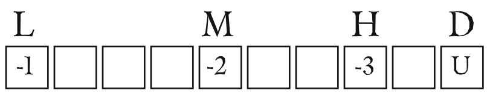
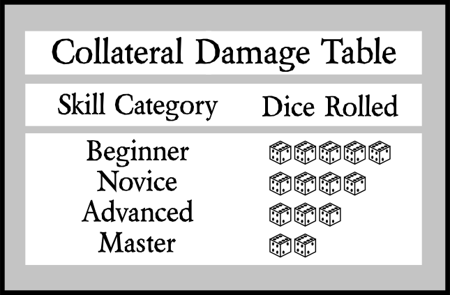
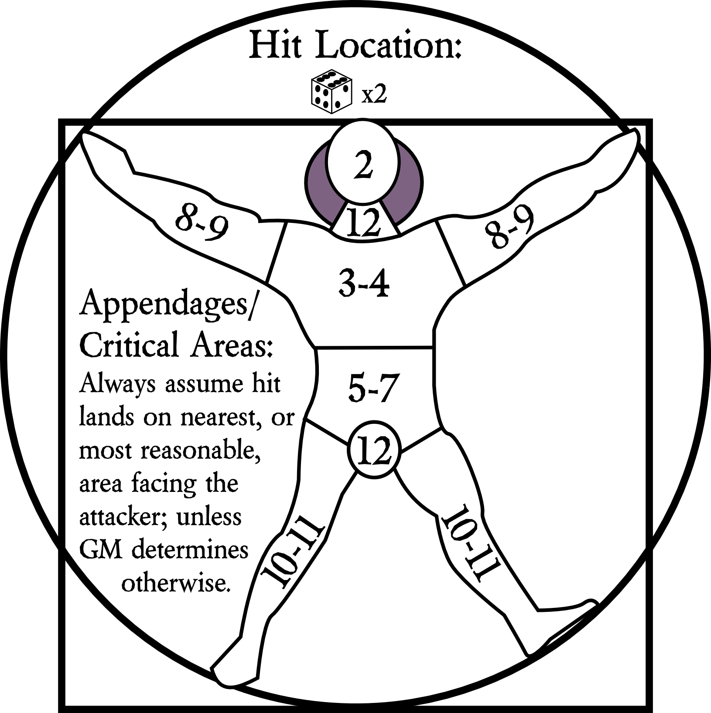
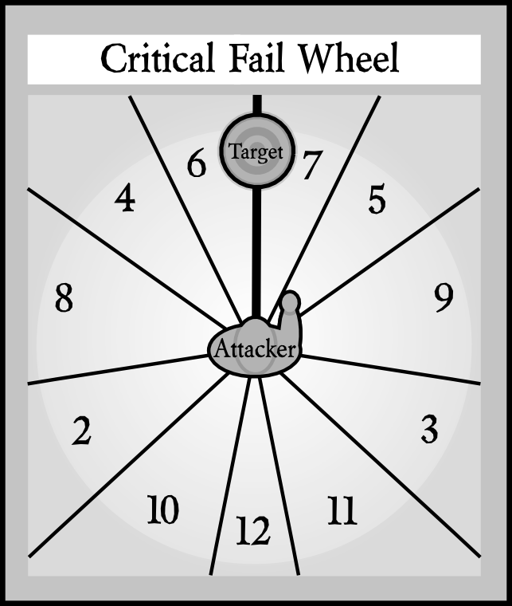
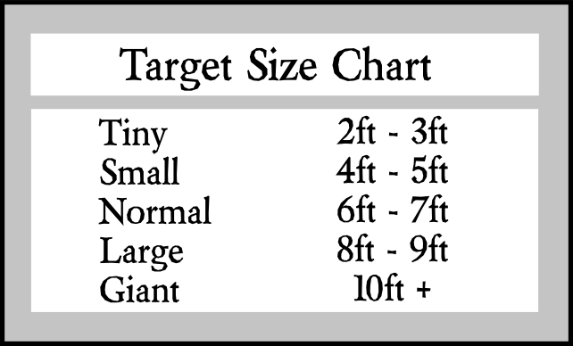

# Combat #
Combat is represented as a series of actions. All actions are rosolved throught skill tests. Each action has a base Target Number that is determined by a difficulty table. The base target number is modified by the Game Master for Sutuational Difficulty, the active Player for Character Skill Modifiers, and the opponent for Defensive Skill Modifiers.

* *Situational modifiers can be positive or negative depending on the current conditions.*
* *Active Skill modifiers are always positive.*
* *Defensive Skill modifiers are always negative.*

The combat sequence is as follows:

* Active Character Initiates combat by describing their intended action.
* Game Master determines the base target number and applies the situational modifiers.
* Active Character applies any skill Modifiers and weapon attack Modifiers.
* Opposing Character rolls against Reflex modifier. Upon success, Opposing Character applies defensive skill Modifiers.
* Upon success, the Active Character sums the weapon damage and any damage Modifiers. 
* Active Character reports the number and damage type to the Opposing Character.
* The Opposing Character subtracts their appropriate resistances from the damage.
* The Opposing Character records the damage in the related damage type box.

*If the damage is below one, no marking is done. See Damage Overload below if damage exceeds the number of available boxes.*

If the attack roll was a *Critical Success* the final damage staging number is doubled. *Critical Failure* may result in the attackar harming self or any friend nearby (at Game Master's discretion).

## Range and Reach Modifiers ##
Range and Reach are how far a character can use projectiles or hit with melee weapons. Each weapon has its own range or reach, and will have the distance number and units listed for each section: Short, Medium, Long, Extreme. These are represented in the character sheet in the weapon section as *S*, *M*, *L*, *E*. 

## Combat Modifiers ##
Combat Modifiers are degrees of difficulty when using projectiles or hitting with melee weapons. These help appropriately change the base Target Number into something more fitting to the situation. The harder the action, the lower the Modifier. Some things, such as aiming or charging toward an enemy may normally gain a bonus Modifier, instead.

### General ###

* Character is making a Called Shot: -4
* Character is concentrating before attack: cumulative +1 per turn, up to three turns. This includes aiming, meditation, and other mental and perception preparations.
* Character is wounded: Already applies to everything, since Health Meter Modifiers are global to the character
* Character's weapon has longer reach: Modifier is difference in Reach
* Character only needs to make contact, not necessarily inflict damage: +2
* Character is attacking multiple targets: -1 per target
* Visibility is obstructed: Depends on the situation(?)

### Ranged ###

* Character is running while attacking: -2 to -4, depending on situation
* Character is in melee combat: -3
* Character is shooting from cover: -1 to -3 depending on type of cover(?)
* Character is shooting blindly: -6
* Target has partial cover: -1 to -3 depending on amount of cover

### Melee ###

* Character is charging into attack: +2
* Character has the superior position: +2
* Target is prone: +3

## Damage ##
The damage system is based on the ancient Greek's beliefs regarding human existence, where a person was measured by the strength and health of their mind, body, and spirit. The optimal case would be to have all three in equal amounts such that they could be represented by an equilateral triangle: Mental -> Physical -> Spiritual -> Mental. Dealing and taking damage is handled through a series of check boxes. There are ten boxes for each of the three types of health. Damage is counted by checking a number of boxes equal to the amount of damage dealt starting at the damage level noted by the weapon's damage type and rating, and all boxes below that level. If a character has already taken damage beyond the indicated level, the new damage is counted by checking off boxes on the next available damage type until all the damage is applied. Damage levels are Light, Moderate, Heavy, and Deadly.

In CCARPS damage comes in three forms; **Mental**, **Physical**, and **Spiritual**. 

Damage is represented as a series of three connected bars of ten boxes each. Box ten on the Mental bar is connected to box one on the Physical bar, and box ten on the Physical bar is connected to box one on the Spiritual bar. The tenth box of Spiritual is connected to box one of the Mental bar.

**Damage overload** occurs when the normal damage bar for the given damage index is full, and more damage of the same type is dealt to a character. The overload damage is then applied to the next damage meter. When a character fills an entire damage bar, that character will lose consciousness.

Once a character is unconscious, the player must roll 2d against their Charisma Modifier as their Basic Target Number. On a failure, the character takes 1 point of damage, following the order of *damage overload*. A character is permanently dead when all three bars are filled completely.

Any character that has two bars of damage filled, they cannot be revived without intervention of a trauma surgeon (or other world and/or campaign-specific skills).

Damage types include Stun, Shock, Bludgeon, Cutting, Piercing, and Energy (some worlds call this "magic").

### Mental ###
Mental Health is the overall well-being of a character's mental state. Mental damage can be caused by a variety of things, from a punch to the face to a flash bomb or electrocution. Spiritual damage overflows into Mental Health.

### Physical ###
Physical damage comes primarily from physical attacks, but can also be caused by Mental Health overload.

### Spiritual ###
Spiritual damage is primarily caused by attacks of wit (interrogation, debate, etc.), but can also come from energy-based attacks. Physical Health damage overflow fills here.

### Damage Levels ###
Damage is represented by three sets of ten boxes. Each damage type (as mentioned above) has its own *Damage Meter Bar*. Damage levels are separated into **Light**, **Moderate**, **Serious**, and **Deadly**. When a character reaches the first box on a given meter, that character will take a -1 penalty to all Target Numbers. At the third box the character takes a -2 to all Target Numbers. At the sixth box the character takes a -3 to all target numbers.

These penalties are cumulative. If a character has registered three physical and six mental damage the total penalty will be -1 + -2 + -3 for the mental damage plus -1 + -2 for a total penalty of -9. These penalties will remain until the damage is healed below the given level.

### Collateral Damage ###
In the case that a player misses an attack, the Game Master rolls to hit all logically available targets, once for each possible target.

### Damage Recovery ###
Mental Health heals over time; Physical Health heals with medical attention; Spiritual Health requires an act of faith, affirmation, or some other type of belief, to heal.

Mental Health recovery time is equal to 10 minutes times the number of damage boxes checked in all three damage indicators. A character with 5 boxes of Mental, 2 box of Physical, and 1 box of Spiritual, marked. 5 + 2 + 1 = 8. 8 * 10 minutes = 80 minutes. After that time, or whenever the Game Master says (in the event they speed time up), all Mental Health boxes are cleared.

	MH Recovery = 10 * # damage boxes filled

Physical Health can be recovered by the application of first aid for the first five boxes, and only if there are five or less boxes filled. If six to eight boxes are marked, a field medic with a standard field medical kit, can heal the character. If nine or ten boxes are marked, the character will need to be treated by a doctor in a hospital or medical clinic. In any case, the recovery time is 10 hours times the number of damage boxes checked in all three damage indicators, divided by the Tech Level of the character rendering aid.

Spiritual Health is the most difficult to regain. Each point of Spiritual damage marked will require a number of hours spent in the act of meditating, praying, or otherwise feeding the soul/spirit to heal. The amount of time is equal to 10 hours times the number of Spiritual Health boxes marked. The spiritual rebuilding exercise must be coordinated through the Game Master and must be in accordance with the character's stated belief system.

## Hit Location Chart ##
When a player designates a target and launches a projectile, the player must roll below the modified target number in order to hit. if the player rolls above the target number the projectile completely misses.

### Shot from the Hip ###
In the case of a hit without a called shot, the gm rolls two hit dice to determine where the projectile hits the target. The values for a humanoid target of each area of the body are as follows:

### Called Shot Miss ###
When a player designates an area to hit on a target, the player must roll below the modified target number to hit. if the player's roll is equal to or greater than the modified target number the players shot will miss. As you may have guessed, this is where Sir Issaic's first law comes in: "An object in motion tends to stay in motion", etc. etc. so that thing; fist, arrow, bullet must go somewhere. The following chart and 1d6 will help you figure out what force will cancel the motion of the object.

Imagine a circle cut into 6 slices overlaid on the target with its center point on the called location. Now roll 1d and count the pie slices clockwise from the top to determine which direction the miss took. Use the difference between the Modified Target Number and the player's roll to determine the magnitude (in whatever units seem appropriate) for the situation. Then, let Sir Isaac prove his stuff by knocking the F out of the projectile, and into the unintended location. Newton's Second Law is "the relationship Force equals mass times acceleration (F = m * a). The creativity gets going when applying Newton's Third Law: "To every action there is always opposed an equal reaction."

### Critical Fail Wheel ###
In the case of a *Critical Fail*, we have a *Critical Fail Wheel*. The Active Character is in the middle of the wheel (as shown below) and any nearby characters, both friendly and enemy, will fall within a certain number. The Active Character rolls 2d, with the sum being the direction in which their action went. This works for both ranged and melee combat.

## Height-based Modifiers ##

Height modifiers are calculated by taking the Opposing Character's Height (rounded) in feet and subtracting the Active Character's height (rounded) in feet. For example, if the Active Character is 7 feet tall and the Opposing Character is 3, the Active Character will have a -4 Modifier to hit and a +4 Modifier to damage. However, when the Opposing Character becomes Active, they will have a +4 Modifier to hit and a -4 Modifier to damage. This helps prevent giant characters from always being able to hit tiny characters as if they were equal in height.

## Dodge, Block, Parry ##
* *Defender's Rule:* Dodge is to evade an attack avoiding all damage on success.
* *Trade off:* defender must forgo any actions including simple actions until defenders next turn.
* Target number is the sum of the attacker's roll to hit and the defender's acrobatics skill modifier.
* Block is to absorb an attack with an object other than the intended target of a given attack
* -4 to repose attack and -2 damage on success.
* Parry is to deflect an attack by exerting a complementary force to move the impact to a more favorable location
* +2 to repose attack requires an armed melee skill

