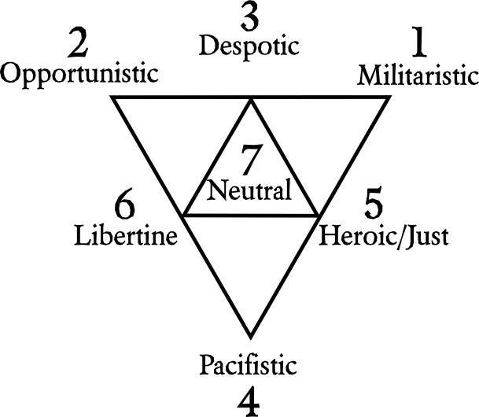

# Disposition #
A character's *Disposition* is the sum of their character sheet. Oddities make up the largest and most lasting *permanent* changes to a character; they give permanent bonuses and detriments. They are the only part of character creation that can modify **any** aspect of a character, including (especially) Attributes, Resistances, and the Health Meter.

**Militaristic:** "Might makes right" is the motto. The character has an ideology that the military is the foundation of a society's security, thus being the most important aspect.  
**Opportunistic:** The practice of taking advantage of any situations or people to achieve an end, often with no regard for principles or consequences.  
**Despotic:** Government by a singular authority, either a single person or tight-knit group, which rules with absolute power, especially in a cruel and oppressive way.  
**Pacifistic:** The doctrine that disputes (especially between countries) should be settled without recourse to violence.  
**Heroic/Just:** Regard for others, both natural and moral without regard for oneself; devotion to the interests of others; brotherly kindness; selflessness; contrasted with egoism or selfishness.  
**Libertine:** One who is freethinking in all matters.  
**Neutral:** Neither beneficial nor harmful; this is the default state of all characters.

*The oddity definitions above are licensed under [Creative Commons Attribution-ShareAlike 3.0 Unported](http://creativecommons.org/licenses/by/3.0/) and taken from Wiktionary.*