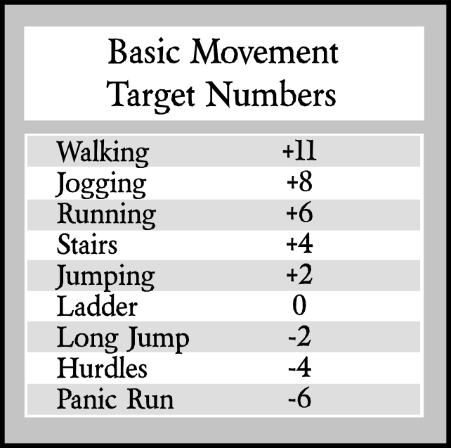

# Movement #

## Base Movement Target Numbers ##
Under non-stressful situations, walking generally doesn't require a roll. This is a base Modifier Table for reference when a character has impediments, such as high encumberance, stress, or during extended combat. 

## Encumberance ##
Player characters can carry mass equal to 10 times their Lift modifier. Every pound over the maximum adds -1 to all physical actions. When a character's Encumberance Modifer brings the overall action Modifier below 0, that character must roll to succeed on simple actions such as walking upright, turning around, stopping quickly, etc.

Armor also affects freedom of movement, depending on armor type and class.

