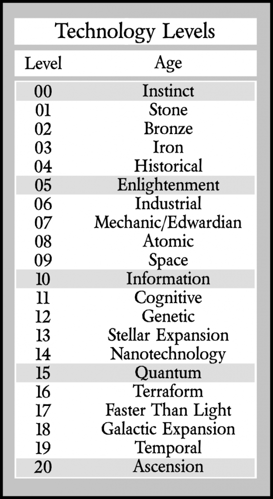

\pagebreak

# Technology Levels #
A character's technology level helps define level adjustments and target numbers when interacting with any technology, from a basic tool (like a club or lever) to a super computer on an inter-dimensional time machine.

Use the list below to determine target numbers. A general rule is to add the tech level difference to the target number if the technology is at a lower level than the character's tech level and subtract from the target number if the technology is at a higher level.

